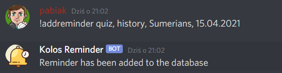

# KolosReminder
Discord bot made with <a href="https://github.com/DV8FromTheWorld/JDA" target="_blank">JDA</a> and springboot that stores your reminders in the database. Written for fun and learning.

Available commands:
!addreminder -> You can add reminder to your database using this template: !addreminder [type], [name], [subject], [date]

!reminders -> Display reminders.

!deletereminder [id] -> this one will delete reminder with provided id from your database

Additionally bot can manage roles. It's very simple, just type the role name on the channel specified in the bot.properties.

